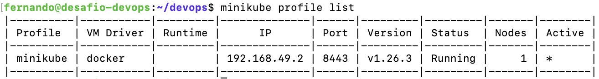
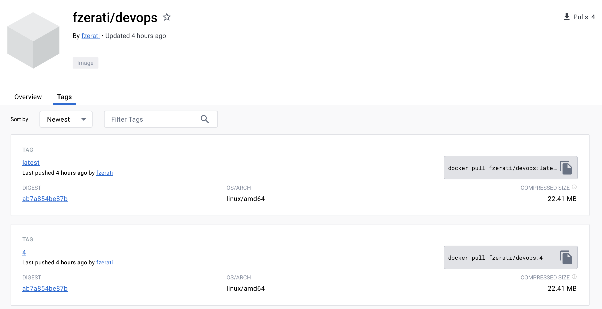
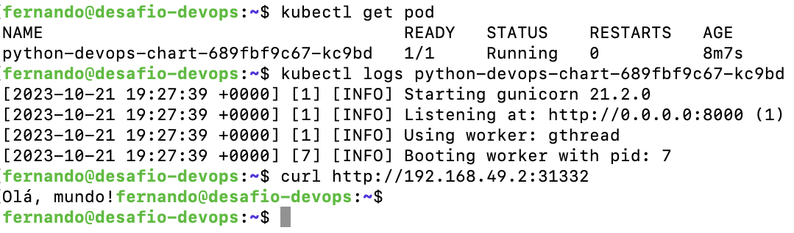

## Desafio DevOps


### Ambiente
Projeto construído localmente em máquina virtual com host executando Proxmox 7.4-17.

Configuração da VM:
- Ubuntu Server 22.04
- 6 CPU
- 12 GB RAM
- 32 GB Disco (iSCSI)

### Stack
- Docker
- Ansible
- Jenkins
- Terraform
- Minikube
- Helm
- Prometheus
- Grafana Loki
- Grafana
- Promtail

### Estrutura
```
.
├── ansible
│   ├── install.yaml
│   └── run.yaml
├── app
│   ├── helm
│   │   └── python-devops
│   │       ├── Chart.yaml
│   │       ├── templates
│   │       │   ├── deployment.yaml
│   │       │   ├── _helpers.tpl
│   │       │   ├── hpa.yaml
│   │       │   ├── ingress.yaml
│   │       │   ├── NOTES.txt
│   │       │   ├── serviceaccount.yaml
│   │       │   ├── service.yaml
│   │       │   └── tests
│   │       │       └── test-connection.yaml
│   │       └── values.yaml
│   └── src
│       ├── app.py
│       ├── Dockerfile
│       ├── requirements.txt
│       └── test_app.py
├── infra
│   └── main.tf
├── jenkins
│   ├── Dockerfile
│   └── pipeline
│       └── Jenkinsfile
├── monitoring
│   ├── docker-compose.yml
│   ├── grafana
│   │   ├── config.ini
│   │   ├── dashboards
│   │   │   └── python-devops.json
│   │   ├── dashboard.yaml
│   │   └── datasource.yaml
│   ├── prometheus
│   │   └── config.yml
│   └── promtail
│       └── promtail.yaml
├── README.md
└── run.sh
```

### Execução
Para executar a stack, clone o repositório e execute o script `run.sh`

```shell
git clone https://github.com/Fernando-Z/devops.git
cd devops
sudo bash run.sh
```

Inicialmente o script realizará a instalação do Ansible via apt e após instalado executará os playbook `install.yaml` que fará a instalação de todas as dependências para a execução da stack e o playbook `run.yaml` que irá executar o Terraform e capturar a senha de instalação do Jenkins.

### Jenkins

A imagem do Jenkins executada é construída via Ansible com base no arquivo `jenkins/Dockerfile`, adicionando na imagem base a instalação do Docker e Helm.

Apesar de instalado automaticamente, o Jenkins deve ser configurado manualmente com a senha de instalação fornecida na execução do script ou executando o comando

```shell
docker exec jenkins cat /var/jenkins_home/secrets/initialAdminPassword
```

Configurar o Jenkins acessando http://IP:8080, garantindo que os plugins Pipeline, Credentials, Git e Pipeline: GitHub Groovy Libraries sejam instalados e as credenciais para o DockerHub e Helm/Kubernetes configuradas.

O arquivo com a configuração do pipeline está no caminho `jenkins/pipeline/Jenkinsfile` e deverá ser configurado com o repositório do DockerHub correspondente às credenciais configuradas.

### Infra

Devido à execução local da stack, não é possível criar e configurar um cluster completo de Kubernetes via Terraform, portanto a escolha foi de executar um cluster Minikube que possui todas as APIs do Kubernetes implantadas e possibilita a validação de todos os passos necessários da implantação deste desafio.

O código tf irá realizar o deploy de um Minikube single-node com os módulos de dashboard e storage habilitados.

### App

A aplicação python está no caminho `app/src` foi construída utilizando Flask e possui os endpoints `/` que retorna a string 'Hello World' e `/metrics` que retorna as métricas para o Prometheus. 

O arquivo Dockerfile foi construído para executar a aplicação em produção utilizando gunicorn e guardar o cache dos layers anteriores (principalmente requirements) evitando a utilização desnecessária de recursos durante o desenvolvimento/build.

Durante a execução do pipeline serão realizados 2 testes, um teste unitário presente no arquivo `test_app.py` que valida o retorno de uma chamada na rota `/` e um teste de lint realizado pela biblioteca `flake8`.

A imagem construída durante a execução do pipeline terá duas tags, a primeira referenciando o número de build do pipeline e a segunda será latest, para deploy no Kubernetes.

O deploy da aplicação é realizado via pipeline utilizando o template `Helm` localizado no caminho `app/helm` com os valores localizados em `app/helm/python-devops/values.yaml`. O nome da imagem também deve ser alterado para executar a stack localmente seguindo a configuração do pipeline.

### Observability

A stack de observability está no caminho `monitoring/` e possui um arquivo `docker-compose.yml` que realiza o deploy do Prometheus, Loki e Grafana com suas respectivas configurações apontadas pelas pastas correspondentes.

A configuração inicial do Prometheus possui como target pré-configurado a aplicação executando no Kubernetes e faz o scraping das métricas da aplicação no endpoint `/metrics`.

A configuração inicial do Loki utiliza todos os parâmetros default da aplicação.

A configuração inicial do Grafana é composta pelos arquivos `datasource.yaml` que pré-configura o Prometheus como datasource padrão e os arquivos `dashboard.yml`/`dashboards/python-devops.json` que configuram um dashboard com as métricas já configuradas para a aplicação python executando no Kubernetes.

A configuração do Promtail é aplicada via Ansible como arquivo de configuração no Kubernetes (`kubectl apply -f monitoring/promtail/promtail.yaml`) e por padrão faz o scraping do stdout/stderr de todos os Pods executando no Kubernetes, incluindo a aplicação python.

### Exemplos

Abaixo estão exemplos da stack executando localmente:










### Autor
- Fernando Zerati Neves